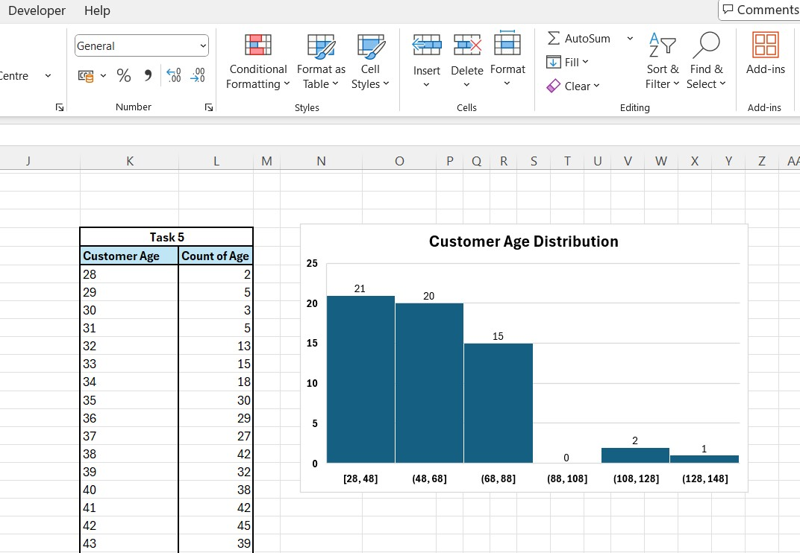
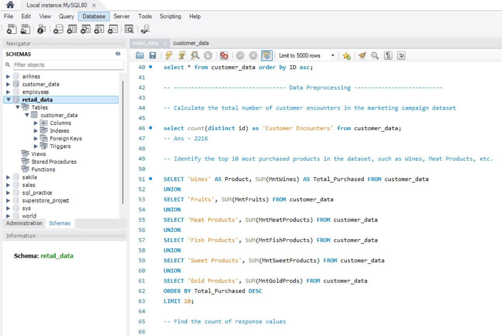

# 🛒 Retail Analytics: Predicting Customer Purchase Behavior

## 📌 Project Overview

- This project analyzes **retail transaction data** to understand customer demographics, purchasing patterns, and marketing campaign responses.
- The objective is to develop insights that can guide **strategic marketing decisions** and **predict customer responses** to future campaigns.

---

## 🎯 Problem Statement

- **RetailVC** aims to enhance its marketing effectiveness by predicting customer purchase behavior and improving promotional targeting.
- By exploring **transaction data**, **demographics**, and **campaign interactions**, the goal is to uncover **key factors** that drive customer engagement and optimize marketing ROI.

---

## 🛠️ Tools Used

* **Excel** – for statistical summaries and basic visualizations
* **SQL** – for data preprocessing and aggregations
* **Python (Pandas, NumPy, Matplotlib, Seaborn)** – for exploratory data analysis (EDA)
* **Power BI** – for interactive dashboards *(Pending)*

---

## 🔍 Approach & Analysis

### 1. 📊 Excel Analysis

#### Statistical Summary of Numerical Features

#### Enrolments by Year (Line Chart)

#### Cross-tabulation: Response vs Education

#### Customer Age Distribution (Histogram)

---

### 2. 🗄️ SQL Data Processing

#### Creating Schema & Tables

#### Data Preprocessing Queries

---

### 3. 🐍 Python Exploratory Data Analysis

#### General Data Overview

#### Descriptive Statistics

#### Distribution of Categorical Variables

#### Identifying Outliers

#### Correlation: Numerical Variables vs Target (Response)

---

## 🧠 Key Insights

* Certain **education levels** have higher marketing response rates.
* **Income** levels strongly influence spending patterns, especially in **wine** and **meat products**.
* Customers in specific **age groups** respond better to promotions.
* Outliers in spending and income can distort trend interpretations and require careful handling.

---

> 📌 *Note: Dataset and source code are excluded to maintain project originality.*
